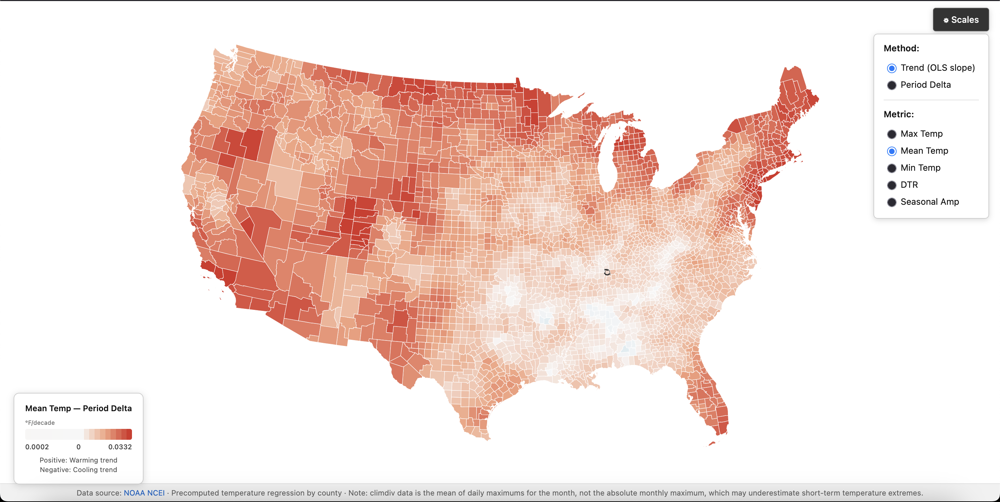

# County Warming Trends

An interactive map showing temperature trends across US counties from 1895
to present. Each county is colored by how its temperature is changing over
time, and clicking a county reveals its full annual temperature history.



Live page accessible here: [https://dibz15.github.io/us-warming-map/](https://dibz15.github.io/us-warming-map/)

## Motivation

The US keeps breaking temperature records year over year. In pursuit of trying to understand
my own local warming trends (how much has it warmed up in my county over my lifetime?) I looked
around online for a map that answered that question and was easy to use and understand. I was
surprised when I couldn't really find anything online besides individual county lookups.

So, I decided to make my own. I hope that it makes it easier to
see and understand how our local climates are changing, and the surprising ways that this can manifest (for example, some areas in the US have cooling summers, but warming winters!). Climate change is real and, in making this tool, I simply hope to understand and visualize the changes I've witnessed in my own (relatively short) lifetime.

For those technically minded, see [`docs/methodology.md`](docs/methodology.md) for the technical detail
on what the underlying data actually represents, how each metric and
color mode is calculated, and where the limitations are.

## Usage

- Pan/zoom: on desktop, click & hold to pan and scroll to zoom. On mobile, pinch to zoom or use one finger to pan.
- Per-county trends. Click on a single county to view its historic trends and change over time.
- Change calculation method or the temperature scaling using the "Scales" menu in the upper-right corner.

## Features

- **Interactive choropleth map** - every US county, colored by temperature
  change
- **Multiple metrics** - max, mean, min, diurnal temperature range (DTR),
  and seasonal amplitude, each selectable independently
- **Two calculation methods** - a century-spanning OLS trend (°F/decade),
  or a direct period-over-period comparison (°F) between two user-chosen
  year ranges
- **Click/hover detail** - see any county's full annual temperature history
  as a chart, with max/min bounds and a mean trend line
- **Colorblind-safe palettes** - diverging scales throughout, including a
  two-channel hue + magnitude scale for DTR that separates "which side is
  changing faster" from "how much is changing overall"
- **Offline data** - all climate data is precomputed at build time; the
  live site makes no runtime calls to NOAA or any other external API

## Data source

Temperature data comes from [NOAA NCEI](https://www.ncei.noaa.gov/)
(National Centers for Environmental Information) - specifically the
nClimDiv county-level dataset. See
[`docs/methodology.md`](docs/methodology.md) for what this data actually
measures (it's not what you might assume) and
[`data-pipeline/README.md`](data-pipeline/README.md) for the mechanics of
fetching and processing it, including a couple of real gotchas in NOAA's
own file format that are worth knowing about before touching the pipeline.

## Local development

```bash
# Install dependencies
npm install

# Build for production
npm run build     # outputs to dist/

# Preview the production build locally at http://localhost:5173
npm run preview
```

## Data pipeline

The Python pipeline in `data-pipeline/` fetches and processes NOAA
county-level climate data, then outputs `public/data/counties.*.json`.
This is committed and preloaded at build time, so the deployed frontend
never needs to reach out to NOAA (or anything else) at runtime.

To regenerate the dataset:

```bash
cd data-pipeline
pip install -r requirements.txt --break-system-packages
python fetch_noaa_county_data.py
python process_to_dataset.py
```

## Project structure

```
src/
  chart/          Popup chart component (annual max/min bounds + mean trend)
  data/           Data loading (TopoJSON + precomputed climate dataset)
  map/            Choropleth rendering + color scales (trend, DTR, period delta)
  styles/         Global CSS
  types.ts        Shared TypeScript types
data-pipeline/    Python scripts for fetching and processing NOAA data
public/data/      Generated dataset (committed to repo)
docs/             Technical/methodology documentation
```

## Tech stack

- **Build**: Vite + TypeScript
- **Map rendering**: D3 (AlbersUSA projection, inline SVG rendering)
- **Charts**: D3 (scales, shapes, arrays, time formatting)
- **Data**: Precomputed JSON dataset + TopoJSON county boundaries
- **Deployment**: Static site deployed to GitHub Pages via Actions

## Further reading

- [`docs/methodology.md`](docs/methodology.md) - what the data represents,
  how each metric is calculated, what OLS trend vs. period delta actually
  measure, and documented limitations
- [`data-pipeline/README.md`](data-pipeline/README.md) - data provenance,
  the NOAA state-code crosswalk, and processing notes
